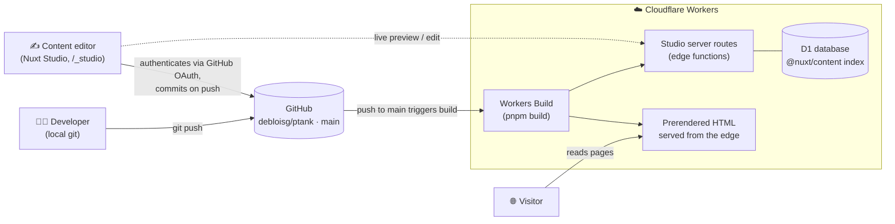
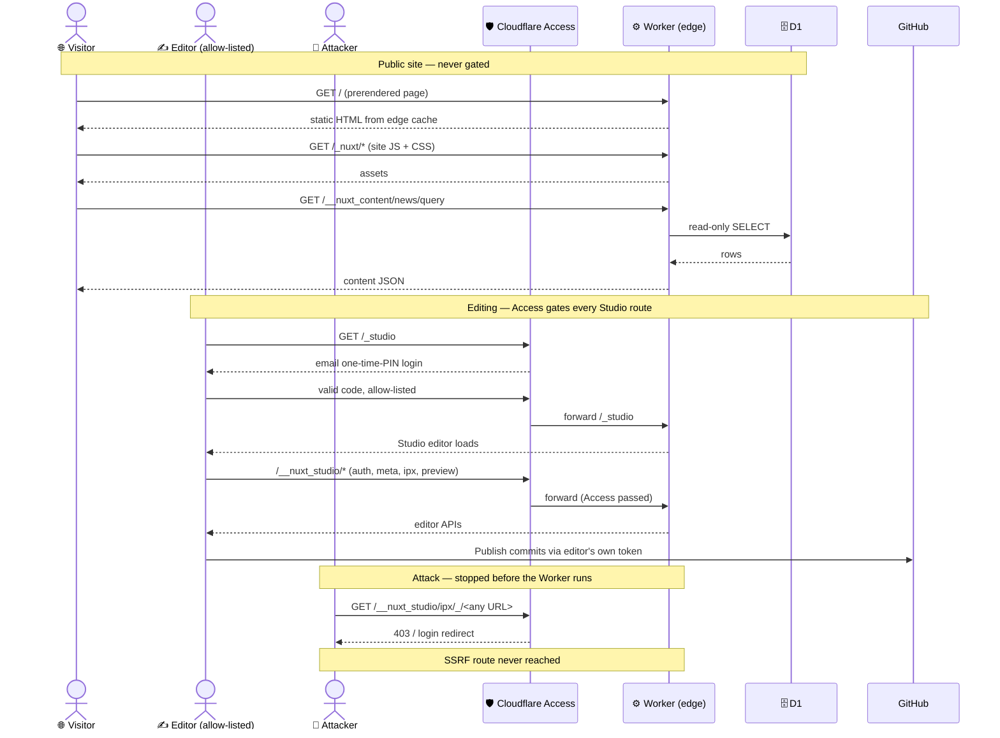

# La Pétanque Fouesnantaise

Website for the pétanque club of Fouesnant (Finistère, France).
Built with [Nuxt](https://nuxt.com) + [Nuxt Content](https://content.nuxt.com),
edited through [Nuxt Studio](https://nuxt.studio), stored on GitHub, and deployed
to Cloudflare Workers.

The whole thing runs on **free tiers** — no server to pay for, no database bill,
no CMS licence. This README explains how the pieces connect, why it costs nothing,
and the one gotcha to know about.

## What each piece is

New to this stack? Here's the one-line version of every tool involved:

- **[Nuxt](https://nuxt.com)** — the framework the site is built with. A Vue-based
  toolkit that turns pages, components, and Markdown into a fast website (handles
  routing, rendering, and the build for you).
- **[Nuxt Content](https://content.nuxt.com)** — a Nuxt module that treats the
  Markdown files in `content/` as the site's database. Write a `.md` file, get a
  page.
- **[Nuxt UI](https://ui.nuxt.com)** — a ready-made library of styled Vue
  components (buttons, cards, navigation…) so the site looks polished without
  hand-building every element.
- **[Tailwind CSS](https://tailwindcss.com)** — the styling system underneath Nuxt
  UI. Instead of writing separate CSS files, you compose styles from small utility
  classes (`flex`, `px-4`, `text-lg`) right in the markup.
- **[Nuxt Studio](https://nuxt.studio)** — an in-browser CMS. It gives non-technical
  editors a visual form to change content, and saves their edits straight back to
  GitHub — no code or terminal needed.
- **[GitHub](https://github.com)** — where all the code and content lives (version
  control). Every change is a commit, and it's the single source of truth that
  triggers deploys.
- **[Cloudflare Workers](https://developers.cloudflare.com/workers/)** — the host.
  It builds the site on every push and serves it from data centers worldwide.
  (This is Cloudflare's full-stack successor to *Cloudflare Pages* — same idea, but
  it can also run the small server functions Nuxt Studio needs. See the gotcha
  below.)

## Static vs. dynamic vs. SSR vs. hybrid — and what we picked

A website has to turn your content into HTML *somewhere*. **Where and when** that
happens is the rendering mode, and it's the single biggest decision behind cost,
speed, and freshness. The four options:

| Mode                          | HTML is built…                          | Needs a running server? | Trade-off                                                        |
| ----------------------------- | --------------------------------------- | ----------------------- | --------------------------------------------------------------- |
| **Static** (SSG / prerender)  | once, at build time                     | No — just files         | Fastest & cheapest, but content is frozen until the next build  |
| **Dynamic** (SPA, client-side) | in the visitor's browser, via JavaScript | No, but ships a blank shell first | Slow first paint, weaker SEO, needs JS to show anything     |
| **SSR** (server-side)         | on the server, fresh on every request   | Yes — one run per visit | Always up to date, great SEO, but you pay for a server per hit  |
| **Hybrid**                    | some pages static, some on-demand       | Only for the on-demand parts | Best of both — static where you can, a server only where you must |

**What we wanted: static.** This is a club site — the news, events, and results
change a few times a month, and thousands of people don't hit it per second.
Prerendering every page to plain HTML means Cloudflare serves files from its edge
cache: instant loads, perfect SEO, and *nothing to run* per visit, so it sits
squarely in the free tier. For the visitor-facing site, static is ideal.

**What we actually needed: hybrid.** Pure static would mean *no server at all* —
but Nuxt Studio's in-browser editor can't work that way. Logging in, saving edits,
and the live preview all rely on server routes (`/_studio`, `/__nuxt_studio/*`,
`/auth/github`) that must run *per request* — you can't prerender a login. So we
compromise: **every visitor page is prerendered static, and only Studio's handful
of routes run on-demand as edge functions.** That mix is exactly what "hybrid"
means, and it's why the site deploys as a Cloudflare Worker instead of a plain
static bundle (details in the **gotcha section** further down).

The payoff: visitors get the speed and zero cost of static, while editors still
get a live CMS — without splitting the project into two systems.

## The stack, in one picture

There are two ways content reaches the live site — a developer pushing code, or a
non-technical editor using the in-browser CMS. Both funnel through GitHub, and a
push to `main` is what triggers a deploy.



**Reading the diagram:**

1. **Editing.** A developer edits Markdown/Vue locally and `git push`es. A club
   volunteer instead opens `/_studio` on the live site, edits content in a form,
   and Studio commits the change back to GitHub through its GitHub App.
2. **GitHub is the single source of truth.** Every change — code or content — is
   a commit on `main`.
3. **Deploy is automatic.** Cloudflare's Git integration (Workers Builds) watches
   the repo. A push to `main` runs `pnpm build` and ships the new version.
4. **Serving.** Almost every page is prerendered to static HTML and served
   straight from Cloudflare's edge. Only Studio's editor routes run as edge
   functions, backed by a D1 database that holds the content index.

## Why it's free (and stays free)

| Piece              | What it does                       | Free tier                                     |
| ------------------ | ---------------------------------- | --------------------------------------------- |
| GitHub             | Source of truth for code + content | Unlimited private repos                       |
| Nuxt Studio        | In-browser CMS for non-coders      | Free for public repos / small teams           |
| Cloudflare Workers | Build + host at the edge           | 100k requests/day, static assets free         |
| Cloudflare D1      | SQLite the content index lives in  | Generous free tier (millions of reads/month)  |
| Cloudflare R2      | Stores + serves the images         | 10 GB storage, 1M reads/mo free               |
| CF Image Transforms | Resizes/reformats images at the edge | 5,000 unique transforms/mo free            |

The reason it stays comfortably inside those limits: **the site is prerendered.**
Every visitor page is built to static HTML at deploy time and served from the
edge cache, so a normal visit costs *zero* function invocations and *zero*
database reads. The paid meters only tick when someone is actively editing in
Studio — which is rare and low-volume.

## Why it's the perfect fit for a site like this

- **Content-driven, low-traffic.** A club site is mostly text, dates, and images
  that change a few times a month — exactly what prerendering + a Git-backed CMS
  is built for.
- **Non-technical editors.** Volunteers update news and events through Studio's
  visual forms; they never touch Markdown, Git, or a terminal.
- **No moving parts to maintain.** No server, no separate database to back up, no
  CMS to patch. Content is just Markdown files in the repo — portable and
  future-proof.
- **Fast everywhere.** Static HTML from Cloudflare's global edge means fast loads
  without any caching layer to configure.

## Images (hosted on R2)

Images are **not** shipped in the deploy bundle. The originals live in
`/image-sources` purely as an upload source; the deployed site serves every
image from a Cloudflare **R2** bucket, resized on the fly by Cloudflare **Image
Transformations** (both free-tier). `@nuxt/image` (`<NuxtImg>`) drives it:

- The **hero** is eager + preloaded (it's the LCP image).
- **Everything else** is lazy-loaded with a blurred low-res placeholder.
- Each image ships a responsive `srcset` (WebP/AVIF via `f=auto`).

Content and components reference images as `/images/<name>`; `nuxt.config.ts`
rewrites that to the R2 bucket and wraps it in `/cdn-cgi/image/<opts>/…`.

**One bucket, two prefixes.** The `ptank-images` bucket holds:
- `images/**` — the curated originals, pushed from `/image-sources` with the
  upload script.
- `studio/**` — media that editors upload through Nuxt Studio, written straight
  to R2 (never committed to Git) via **NuxtHub blob** (`@nuxthub/core`, `hub.blob`,
  bound as `BLOB` in `wrangler.jsonc`). `@nuxthub/core` runs in self-hosted mode —
  just the R2 binding, no NuxtHub account. (NuxtHub's hosted admin dashboard was
  sunset 2025-12-31; browse the bucket in the Cloudflare dashboard or via
  `wrangler r2 object …` instead.)

### One-time setup (Cloudflare dashboard + CLI)

1. **Create the bucket:** `pnpm dlx wrangler r2 bucket create ptank-images`
2. **Upload the curated originals:** `BUCKET=ptank-images ./scripts/upload-images-to-r2.sh`
   (needs `pnpm dlx wrangler login` first).
3. **Make the bucket public** via a custom domain (R2 → Settings → Public
   access → Connect domain, e.g. `img.<your-domain>`). A subdomain of the site's
   own zone is ideal.
4. **Enable Image Transformations** on the zone (dashboard → Images →
   Transformations → *Enable for zone*).
5. **Set the env vars** (Worker Settings → Variables, and local `.env` — see
   `.env.example`):
   - `NUXT_IMAGE_R2_BASE=https://img.<your-domain>` — how `/images/**` is served.
   - `S3_PUBLIC_URL=https://img.<your-domain>` — how Studio's `studio/**` uploads
     are served (normally the same value).

Until `NUXT_IMAGE_R2_BASE` is set the images won't resolve, so do the upload
(step 2) before flipping the env var live. The `BLOB` R2 binding is already in
`wrangler.jsonc`, so deploys carry it automatically.

## SEO & accessibility

- **`@nuxtjs/seo`** generates `sitemap.xml`, `robots.txt`, canonical + Open
  Graph tags and schema.org JSON-LD. Set `NUXT_PUBLIC_SITE_URL` to the real
  domain. (Dynamic OG-image rendering is disabled — its satori/wasm runtime
  would push the Worker past the free-tier size limit; static `og:image` still
  works.)
- **`nuxt-a11y`** + a dev-only plugin (`app/plugins/a11y.client.ts`) run
  axe-core on every route during `nuxt dev` and log WCAG violations to the
  browser console. Zero production overhead.

## ⚠️ The one gotcha: Studio needs serverless functions

You might expect a site this static to deploy as a plain static export (`nuxt
generate`) with no server at all. It can't — **Nuxt Studio's live editor needs
server-side routes running on the edge.** That has three consequences baked into
the config:

1. **Deploy as a Worker, not a static site.** The Nitro `cloudflare_module`
   preset (see `nuxt.config.ts`) builds a Worker with a server entry, so
   `/_studio` and `/__nuxt_studio/*` can run as edge functions. `wrangler.jsonc`
   points `main` at that server bundle while serving prerendered pages as static
   assets — hybrid rendering.
2. **A D1 database is required.** `@nuxt/content` needs a SQL database on
   Cloudflare to serve its content index at runtime. The binding **must** be
   named `DB`. Create it once:
   ```bash
   wrangler d1 create ptank   # paste the returned id into wrangler.jsonc
   ```
3. **`nodejs_compat` + a recent compatibility date.** Required so Nitro picks the
   modern preset. (An older date selects a legacy preset whose polyfill step
   fails to parse unhead's bundle — see the `replace: { 'typeof window' }`
   workaround comment in `nuxt.config.ts`.)

The upside: those functions only run during editing, so they don't eat into the
free tier under normal visitor traffic.

## Setting up Studio login (GitHub OAuth)

For editors to log into Studio and commit changes, Studio authenticates them
against GitHub using a **GitHub OAuth App**. You create the app once, then hand
its two credentials to Cloudflare as environment variables.

### 1. Create the GitHub OAuth App

Go to **GitHub → Settings → Developer settings → OAuth Apps → New OAuth App**
(<https://github.com/settings/developers>) and fill in:

| Field                          | Value                                   |
| ------------------------------ | --------------------------------------- |
| **Application name**           | e.g. `Pétanque Fouesnantaise – Studio`  |
| **Homepage URL**               | `https://<your-domain>`                 |
| **Authorization callback URL** | `https://<your-domain>/auth/github`     |

> The callback path is always `/auth/github` — that's the Studio server route
> that handles the OAuth handshake. Get this exact, or login fails with a
> redirect-mismatch error.

Create the app, then click **Generate a new client secret**. You now have two
values: the **Client ID** and the **Client Secret**. Copy the secret now — GitHub
only shows it once.

### 2. Give the credentials to Cloudflare

Studio reads these environment variables at runtime (they map into the Worker
from Cloudflare):

| Variable                      | What it is             | Store as                   |
| ----------------------------- | ---------------------- | -------------------------- |
| `STUDIO_GITHUB_CLIENT_ID`     | OAuth App Client ID    | plain variable             |
| `STUDIO_GITHUB_CLIENT_SECRET` | OAuth App Client Secret | **encrypted secret**       |

Set them either from the CLI:

```bash
# Plain variable (the client id isn't sensitive)
wrangler secret put STUDIO_GITHUB_CLIENT_ID       # or add it under [vars] in wrangler.jsonc
# Encrypted secret — never commit this value
wrangler secret put STUDIO_GITHUB_CLIENT_SECRET
```

…or in the **Cloudflare dashboard → your Worker → Settings → Variables and
Secrets**: add `STUDIO_GITHUB_CLIENT_ID` as a plaintext variable and
`STUDIO_GITHUB_CLIENT_SECRET` with the **Encrypt** option on.

> Never put the client secret in `wrangler.jsonc` or any committed file — the
> gitleaks pre-commit hook is there to catch exactly that.

### Optional variables

| Variable                     | When you need it                                                              |
| ---------------------------- | ----------------------------------------------------------------------------- |
| `STUDIO_GITHUB_REDIRECT_URL` | Override the callback URL (auto-detected from the request; set only if wrong) |
| `STUDIO_GITHUB_MODERATORS`   | Comma-separated GitHub usernames allowed to edit (locks Studio down)          |

## 🔒 Securing the Studio routes (important)

Studio's convenience comes with a real security caveat, and it's worth
understanding before the site goes public.

The edge functions Studio adds — `/_studio` and everything under
`/__nuxt_studio/*` — are gated by **authentication only, not authorization**. The
module checks *"are you logged in?"*, never *"do you have permission to edit this
repo?"*. The only permission gate is the `STUDIO_GITHUB_MODERATORS` allowlist, and
**when that variable is unset it is skipped entirely** — so *any* GitHub user who
completes the OAuth login gets a full Studio session.

### What an attacker can — and can't — do

A logged-in non-collaborator **cannot change the live site**: they can't commit
(that needs GitHub write access), and they can't tamper with content — edits live
as drafts in the editor's *own browser* until published, and the content database
is rebuilt from Git on every deploy.

But they **can** reach `/__nuxt_studio/ipx/**`, Studio's image-proxy route. With the
default media config (no external-domain allowlist), it fetches an **arbitrary URL
server-side and returns the response** — turning your Worker into an authenticated
**open proxy / SSRF** running from Cloudflare's edge:

```
GET /__nuxt_studio/ipx/_/https://any-target/...      # with any valid Studio session
```

That can relay traffic, reach services that trust Cloudflare's IPs, or burn your
Worker quota. It's the reason the Studio routes must **not** be openly reachable on
the public internet.

### The fix: gate the Studio routes with Cloudflare Access

Put **Cloudflare Access** (Zero Trust) in front of the Studio routes. Access
authenticates at the **edge, before the Worker runs**, so unauthenticated requests —
browser or `curl` — are bounced before they touch a single Studio route.

**Gate these paths** — one Access application, with an *Allow* policy that
email-one-time-PINs your editors:

| Path                                | What it is                                          |
| ----------------------------------- | --------------------------------------------------- |
| `/_studio`, `/_studio/*`            | the editor / login page                             |
| `/__nuxt_studio`, `/__nuxt_studio/*` | the Studio API — **includes the `ipx` SSRF route**  |

**Leave these public** — gating them breaks the site:

| Path                | Why it must stay open                                |
| ------------------- | ---------------------------------------------------- |
| `/_nuxt/*`          | the site's own JS/CSS bundle                         |
| `/__nuxt_content/*` | read-only content API the pages call at runtime      |
| everything else     | the actual public website                            |

### Every route at a glance

| Route                        | What it does                                                     | Reachable by            |
| ---------------------------- | --------------------------------------------------------------- | ----------------------- |
| `/`, `/actualites`, `/resultats`, … | Prerendered site pages (static HTML)                     | 🌐 everyone             |
| `/_nuxt/*`                   | The site's compiled JS & CSS                                    | 🌐 everyone             |
| `/__nuxt_content/*`          | Read-only content query API (reads D1) the pages call at runtime | 🌐 everyone            |
| `/_studio-app/*`             | Static assets of the editor UI (inert — syntax highlighters, …) | 🌐 everyone (safe)      |
| `/_studio`                   | Studio editor + login page                                      | 🔒 Access only          |
| `/__nuxt_studio/auth/*`      | OAuth login handshake + session                                 | 🔒 Access only          |
| `/__nuxt_studio/meta`        | Editor metadata                                                 | 🔒 Access only          |
| `/__nuxt_studio/ipx/**`      | Server-side image proxy — **the SSRF route**                    | 🔒 Access only          |

Three kinds of request, one edge gate:



> **Access needs a custom domain.** A self-hosted Access application's hostname must
> be an active zone in your Cloudflare account — you **cannot** path-scope Access on
> a raw `*.workers.dev` subdomain. Move the site to a custom domain first (add the
> domain to Cloudflare, then assign it to the Worker under *Settings → Domains &
> Routes*), and update the OAuth callback URL (and `STUDIO_GITHUB_REDIRECT_URL` if
> set) to match.

> **No custom domain yet?** As an interim measure set `STUDIO_GITHUB_MODERATORS` to
> your editors' GitHub usernames. That closes the hole — the `ipx` route needs a
> session, and a session now needs an allowlisted user. It's weaker than Access (it
> trusts the module's own check and still exposes the routes to any GitHub login),
> but while the routes are public it is **not optional**.

## Local development

```bash
pnpm install
pnpm dev        # http://localhost:3000
```

Build / preview a production bundle locally:

```bash
pnpm build
pnpm preview
```

### Secret scanning (optional but recommended)

A gitleaks pre-commit hook blocks secrets from being committed. Enable it once:

```bash
pre-commit install
```

## Deploying

You normally don't deploy by hand — **push to `main` and Cloudflare builds it.**
The first-time setup is:

1. In the Cloudflare dashboard, connect the `debloisg/ptank` repo to a Workers
   project (Workers Builds / Git integration).
2. Create the D1 database (`wrangler d1 create ptank`) and paste its id into
   `wrangler.jsonc`.
3. Push to `main`. Every subsequent push — from a developer or from Studio —
   redeploys automatically.

## Project layout

| Path                | What lives there                                        |
| ------------------- | ------------------------------------------------------- |
| `content/`          | All page + post content as Markdown (edited via Studio) |
| `content.config.ts` | Content schema — drives Studio's auto-generated forms   |
| `app/pages/`        | Route pages (news, events, competitions, results, …)    |
| `app/components/`   | Reusable UI components                                  |
| `app/app.config.ts` | Brand color map (marine / clay / sage / stone)          |
| `nuxt.config.ts`    | Nuxt + Nitro (Cloudflare) + Studio configuration        |
| `wrangler.jsonc`    | Cloudflare Workers runtime config (D1 binding, assets)  |
